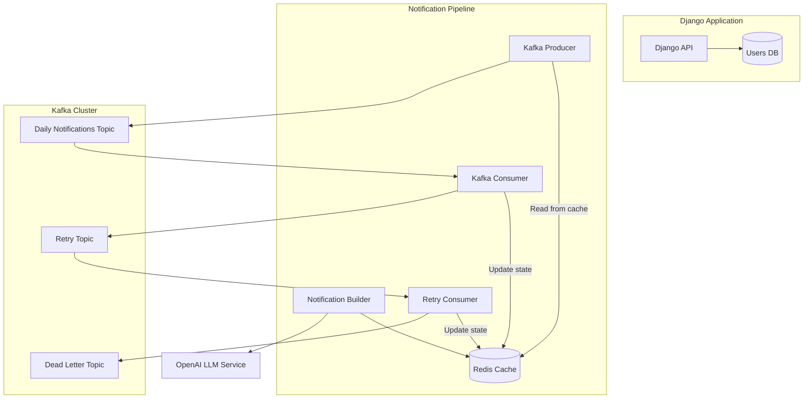
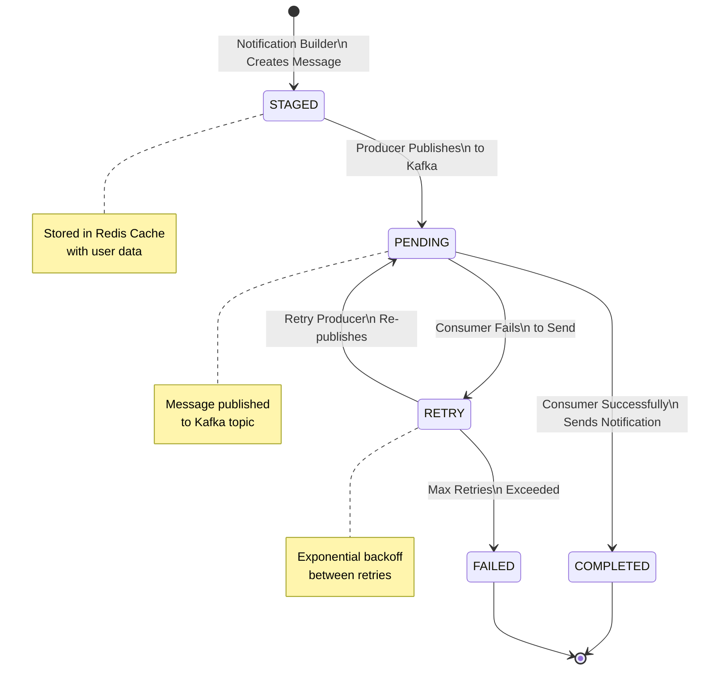

# Health Notification System

A distributed system for generating and delivering personalized health notifications using OpenAI's GPT models. The system processes notifications based on user preferences and health goals, with built-in retry mechanisms for reliable delivery.

## System Architecture

The system consists of several microservices working together:



## Notification Workflow

Each notification follows this state machine:



## Features

- **Personalized Health Notifications**: Generates custom notifications based on user health goals and preferences using LLM
- **Reliable Message Processing**: Kafka-based message processing with retry mechanism
- **State Management**: Redis-based caching for notification states and processing
- **Scalable Architecture**: Microservices architecture using Docker containers
- **User Management**: Django-based user API with PostgreSQL storage
- **Configurable Retry Logic**: Exponential backoff for failed notifications
- **Dead Letter Queue**: Failed messages after max retries stored for analysis

## Prerequisites

- Docker and Docker Compose
- Python 3.11+
- OpenAI API key for LLM integration

## Installation & Setup

1. Clone the repository:
```bash
git clone <repository-url>
cd health-notification-system
```

2. Set up environment variables:
```bash
cp .env.example .env
# Edit .env with your configuration
```

Required environment variables:
- `OPENAI_KEY`: Your OpenAI API key
- `DJANGO_SECRET_KEY`: Django secret key
- `POSTGRES_*`: Database configuration
- `REDIS_URL`: Redis connection string

3. Start the services:
```bash
docker-compose up -d
```

4. Initialize the database:
```bash
docker-compose exec web python manage.py migrate
```

## Usage

### Managing Users

Users can be managed through the REST API.

### Monitoring Notifications

Monitor Kafka topics using the Kafka UI:
```bash
open http://localhost:8080
```

Inspect notification cache:
```bash
docker-compose exec web python manage.py inspect_notification_cache --action stats

## Management Commands

The system provides several Django management commands for monitoring, managing notifications, and development:

### inspect_notification_cache

Inspect and manage the notification cache. Available actions:

```bash
# Show cache statistics
python manage.py inspect_notification_cache --action stats

# List all notifications in cache
python manage.py inspect_notification_cache --action list

# Clear the cache
python manage.py inspect_notification_cache --action clear

# Dump full cache contents
python manage.py inspect_notification_cache --action dump
```

Optional parameters:
- `--timezone`: Filter by specific timezone (e.g., "America/New_York")
- `--date`: Filter by specific date (YYYY-MM-DD)

Example usage:
```bash
# Show stats for a specific timezone and date
python manage.py inspect_notification_cache --action stats --timezone America/New_York --date 2024-01-05

# Clear cache for a specific timezone
python manage.py inspect_notification_cache --action clear --timezone Europe/London
```

### generate_test_users

Generate test users with randomized health goals and preferences for development and testing:

```bash
# Generate 10 test users (default)
python manage.py generate_test_users

# Generate specific number of users
python manage.py generate_test_users --count 50

# Generate users with specific timezone
python manage.py generate_test_users --timezone "America/New_York"
```
```

## Development

### Running Tests

```bash
# Run all tests
pytest

# Run with coverage
pytest --cov=.
```

### Code Quality

```bash
# Run linting
flake8
black .
isort .
```

## Areas for Improvement

### Production Readiness
- Implement managed services:
  - Use managed Kafka service (e.g., Confluent Cloud, AWS MSK)
  - Use managed Redis service (e.g., Redis Enterprise, AWS ElastiCache)
  - Use managed PostgreSQL (e.g., AWS RDS, GCP Cloud SQL)
- Add load balancing and horizontal scaling capabilities
- Implement proper authentication and authorization
- Configure proper network security and VPC setup

### Technical Improvements
- Implement multi-stage Docker builds for smaller images
- Add comprehensive metrics using Prometheus:
  - Message processing latency
  - Success/failure rates
  - Cache hit/miss rates
  - Queue lengths and processing times
- Set up Sentry for error tracking and monitoring
- Enhance logging:
  - Structured logging with correlation IDs
  - Log aggregation (e.g., ELK stack)
  - Better error context and stack traces
- Add API documentation (e.g., OpenAPI/Swagger)
- Implement better message idempotency. Current implementation caching notifications by user_id offers some security, but could be improved
- Add health checks for all services
- Implement circuit breakers for external services

### Feature Enhancements
- Add user notification preferences (time of day, frequency)
- Implement notification templates and categorization
- Add support for multiple notification channels (email, SMS)
- Implement notification analytics and feedback
- Add A/B testing capabilities for message effectiveness using Argo Rollouts (https://argo-rollouts.readthedocs.io/en/stable/features/experiment/)
- Implement user timezone handling
- Implement user feedback collection and analysis

### Testing & Quality
- Add integration tests for full notification flow
- Implement chaos testing for reliability (https://www.splunk.com/en_us/blog/learn/chaos-testing.html#:~:text=Chaos%20testing%20is%20a%20part,such%20failures%20in%20the%20future)
- Add performance benchmarking
- Implement automated load testing

### Security & Compliance
- Implement proper secrets management
- Add audit logging
- Consider HIPAA/GDPR compliance requirements
- Implement data encryption at rest
- Add rate limiting and throttling
- Implement proper API authentication
- Add security scanning in CI/CD pipeline